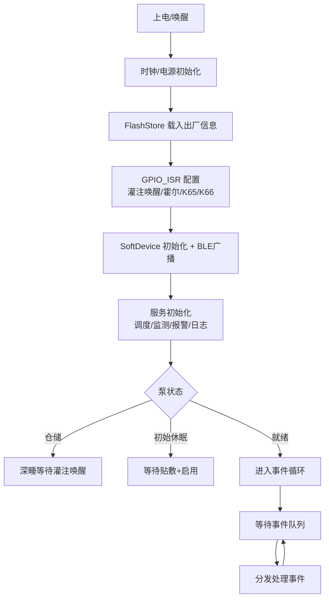
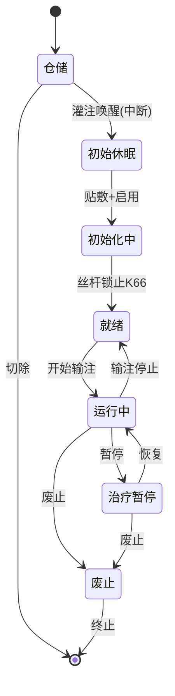
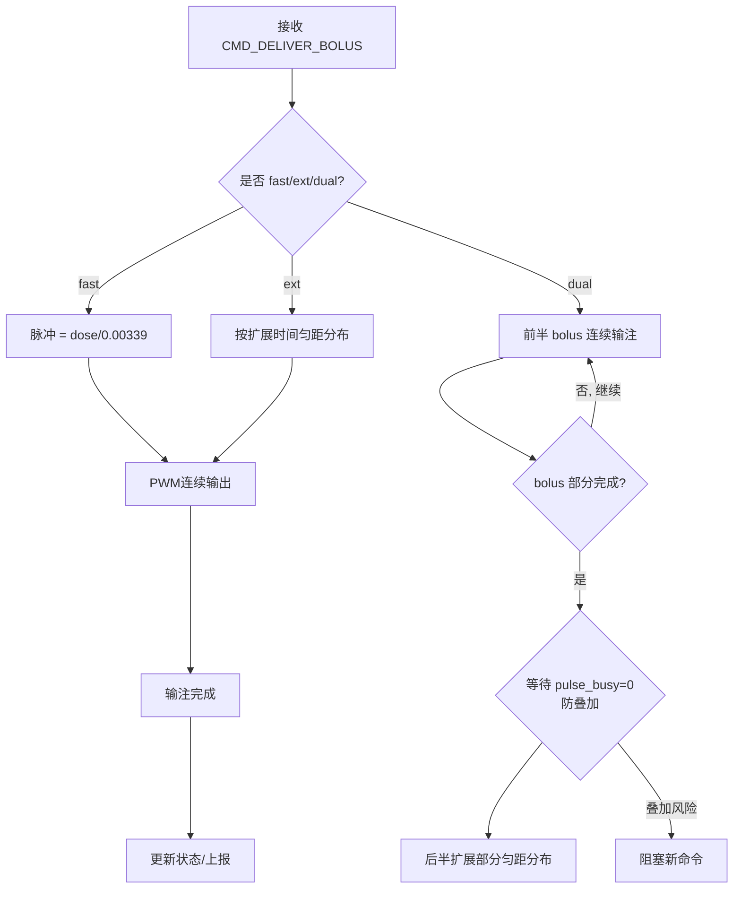
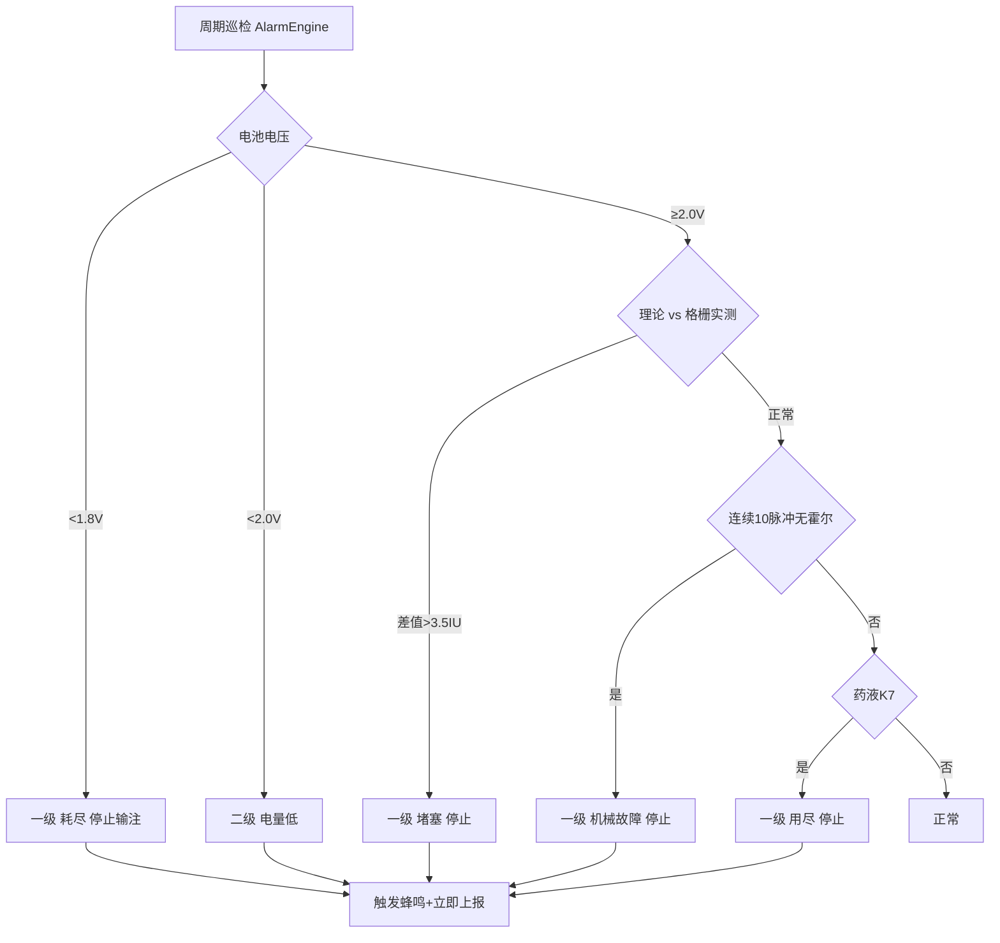
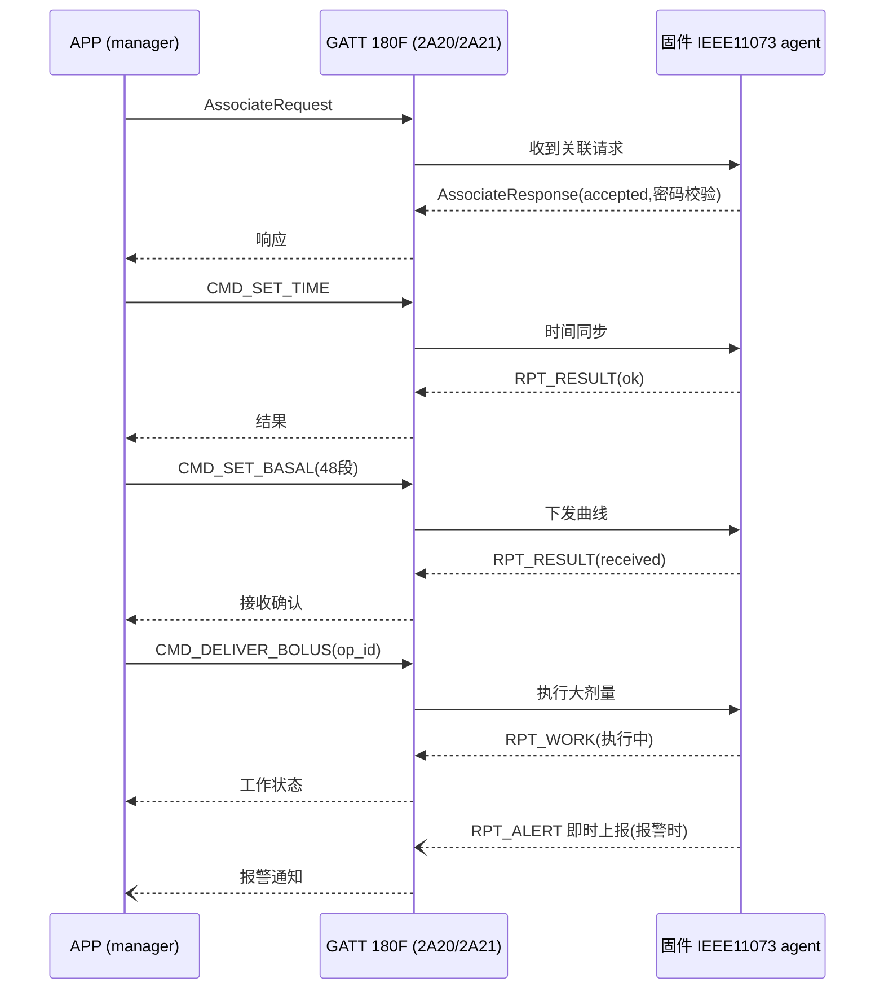
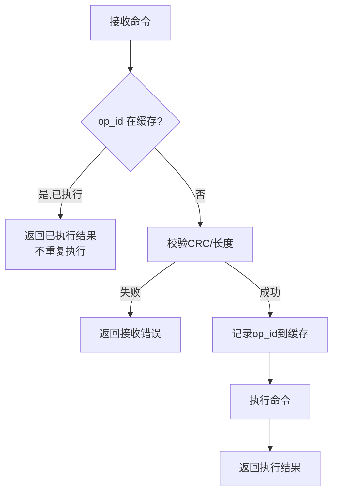

# Pumpilot 固件 模块流程图

**项目名称**：Pumpilot — 睿昇胰岛素泵泵体固件（nRF52832）
**文档版本**：v1.0
**编制日期**：2026-08-04
**说明**：mermaid 源码可直接在支持 mermaid 的渲染器（浏览器/编辑器）中显示；PDF 中会以代码块呈现，另提供对应 HTML 可视化文件。

---

## 1. 固件主流程（启动 + 事件循环）



---

## 2. 泵状态机（StateMachine）



---

## 3. 基础率调度（3分钟周期）

```mermaid
flowchart TD
    A[3分钟定时中断] --> B[计算当前时段 seg = now/30]
    B --> C[读段基础率 basal_table[seg]]
    C --> D[脉冲 = floor(seg_rate × 0.5 / 0.00339)]
    D --> E{余量累计 ≥ 1脉冲?}
    E -->|是| F[补发1脉冲<br>余量清零]
    E -->|否| G[保持余量]
    F --> H[PWM输出脉冲+霍尔校验]
    G --> I[累计已注射基础率]
    H --> I
    I --> J[更新FlashStore当前状态]
```

---

## 4. 大剂量调度（含复合双波切换）



---

## 5. 药量监测（格栅蛇形映射）

```mermaid
flowchart TD
    A[GridScanner 扫描8×8矩阵] --> B[定位唯一接通键]
    B --> C[查蛇形物理次序表 grid_seq[64]]
    C --> D[物理序号 = index]
    D --> E[药量 = (序号-1)/63 × 2.0 ml]
    E --> F{位置判断}
    F -->|K7 接通| G[药液用尽 一级报警]
    F -->|K1 接通| H[药量低 二级报警]
    F -->|其他| I[正常状态]
    G --> J[上报+停止输注]
    H --> J
    I --> K[更新 ReservoirMonitor 状态]
```

---

## 6. 报警引擎（分级巡检）



---

## 7. BLE 通信流（IEEE 11073 agent）



---

## 8. 命令幂等处理（防重复输注）



---

## 9. 深度（事件）序列汇总

### 9.1 首次绑定时序
| 步骤 | 方向 | 内容 |
|:----:|:----:|------|
| 1 | APP→固件 | AssociateRequest(密码校验) |
| 2 | 固件→APP | AssociateResponse(accepted) |
| 3 | APP→固件 | CMD_SET_TIME |
| 4 | APP→固件 | CMD_SET_BASAL(48段) |
| 5 | APP→固件 | CMD_SET_PARAM |
| 6 | 固件→APP | RPT_RESULT(ok) |

### 9.2 异常路径清单
| 场景 | 处理 |
|------|------|
| 电池<1.8V | 一级耗尽 + 停止 |
| 堵塞 | 一级 + 停止 |
| 机械故障 | 一级 + 停止 |
| 药液用尽 K7 | 一级 + 停止 |
| 双波叠加 | 切换点等待缓冲清空 |
| 命令重复 op_id | 幂等去重 |

---

*本流程图为固件模块设计基线，随实现与联调更新。*
